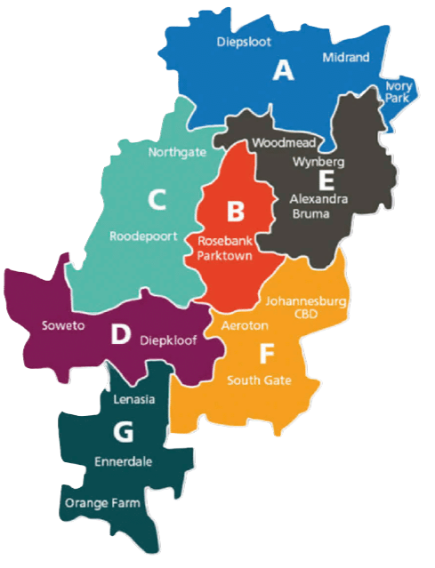

## **Final Project**

### **Task 05.01 - Johannesburg Population Density Map**

You can find my final project in [this Github Repo](https://github.com/imogendrews/johannesburg_population/tree/main). this GitHub repository. To run the code use npx vite, for some reason the npm script didn’t work for me. You can read more about the background of my project on the website itself.

- **Summary**

For my final project, I created a heightmap-based population data visualization of Johannesburg. The lecture topic my project relates to is ‘abstraction’, which we explored in Session 1. I wanted to take population data—typically presented in tables or standard graphs—and transform it into something more artistic. The goal was to speak not only to the logical mind but also to the empathetic one.

I was inspired by Simon Sherrer’s series of heightmap-based population visualizations of various European countries (example shown below).

This project is also an example of *procedural generation*: I wrote the code to generate the visualization, then fed it the population data, allowing the program to determine the final form. While I made some aesthetic adjustments along the way, the "mountain range" itself was generated directly by the code using the data—it wasn't something I sculpted manually.

Having been born and raised in Johannesburg, I always knew the city was unequal—but I didn’t fully grasp the scale of this inequality until I left. When I came across Sherrer’s work, I immediately thought that this kind of visualization could be a powerful way for fellow Joburgers—and others—to viscerally understand the spatial realities of inequality in the city.

Concept

- **Implementation**

I decided to use a combination of D3.js and Three.js for my project. I had initially planned to use Unreal Engine, but as the idea developed, I realized I wanted the final result to be a small, interactive website that anyone could easily access. Unreal, while powerful, wasn’t the best fit for this goal.

Unfortunately, I couldn’t find any tutorials that directly explained how to make the kind of visualization I envisioned. So I relied on my existing knowledge of D3.js and Three.js from previous classes and projects—along with a lot of help from ChatGPT, which helped me understand the logic behind certain techniques and guided me through problem-solving.

I began by looking for population data. This proved to be challenging, as there are very few online resources available for Johannesburg. The only shapefile I was able to find was one showing the city's administrative wards. Luckily, this worked well for my purposes, as it divided the city into manageable clusters of suburbs. One downside, however, was that some wealthy suburbs are directly adjacent to much poorer areas, which made the visual contrasts less stark in certain places. Still, overall, the results felt like an accurate visual representation of Johannesburg’s inequality.

For the population data, I used a dataset from WorldPop, which provides global population estimates. Ideally, I would have liked to use an official dataset from the city itself, but the most recent one available was from 2011. The WorldPop dataset, from 2020, matched the year of the ward shapefile I had, making it a better choice.

I combined the two datasets using QGIS and exported them as a GeoJSON file, which I then imported into my project. To position the wards correctly on a 3D plane, I used D3’s ‘geoMercator’ projection, which works well with GeoJSON features. Each feature included a geometry object (in my case, a MultiPolygon), which contained coordinates outlining the shape of each ward. I used ‘geoCentroid’ to calculate the center point of each shape, which helped in positioning and assigning data.

In Three.js, I created a plane geometry and applied  ‘inverse distance weighting’ to determine the height of each vertex based on nearby population data. To ensure a consistent and proportional mapping between population values and elevation, I used D3’s ‘scaleLinear’. The result is a smooth, heightmap-style elevation model of Johannesburg, where densely populated areas rise like mountains.

To enhance interactivity, I implemented raycasting so users can hover over different wards and see details like suburb names and population. I also added a transparent map overlay of Johannesburg to help provide geographic context for viewers unfamiliar with the area.

- **Results**

The result is a mountainous 3D visualization where users can navigate using Three.js's  Orbit Controls. Viewers can click on different "mountains" using the raycaster, which triggers a pop-up displaying information about the selected ward—including its population size and the suburbs it encompasses. I also added an optional map that users can get using the button ‘Show map’ that appears next to the visualization to help users better understand Johannesburg's geography and the spatial context of the data representation. Below are some pictures of my project: 

- **Project Reflection & Discussion**

Learning how to do a visualisation like this was great, and I am happy I was also able to learn a bit more about QGIS, D3.js and Three.js.  I did struggle with understanding how to put everything together due to there not being any tutorials on this exact implementation so it took more time that what was suggested but I feel like that was time well spent. I really wanted to make the optional map hover over the terrain and adjust its size according to the size of the map but I spent a whole day trying to do this and eventually gave up. I kept the methods I tried to use in my code in order to look into it in the future. I think in general there are a few small  things I would change with more time. I would cut down the amount of suburbs that are displayed in the pop ups and think about how to explain the project better. I would have also liked to played around with the ‘look’ of the mountains a bit more  and will definately work on that in the future. My goal is to also make this website public so I will have to refine things a bit further before I do that. Certain things like when you flip over the object and try to look at the wards there you get stuck there and have to reload the page so I will definately work on that! 

- **Lessons Learned**

I think one of the most valuable lessons was just how to approach using data in visualisations and finding out which tools are best for this. Learning about QGIS and the capabilities of D3 and Three.js was great and I can definitely see myself using things like ‘geoMercator’ in the future. I think the scale of the project was a bit big so next time I would have maybe focussed on something a bit smaller so that I could have finished the submission in the time allocated.

## **Wrap-Up**

### **Task 05.02 - Feedback**

Please answer the following questions briefly so that I can further improve the lecture for future students.

- **How would you rate the difficulty of this lecture from 1 (far too easy) to 5 (far too difficult)?** 3
- **How would you rate the amount of work you had to put into this lecture so far from 1 (no work at all) to 5 (far too much work)?** 3
- **How well did the given time estimates for each session match the time you needed to complete the session?**  I always went above the time estimates but I think that this is because I was new to a lot of topics in this course.
- **What do you think about Unreal as tool to learn for a CTecht student? Is it valuable?** I personally do not like it very much due to it being hard to run on my computer but in general I think it is useful for other CTech students to learn.
- **What do you think about Unreal as a tool for this class? I am fully aware that the Unreal exercises do not yet fully connect to the theoretical topics, try to answer this question also regarding whether you could imagine that Unreal exercises could potentially fit well to the theory.** - I think Unreal has its place as a tool but it’s only really good for some of the topics we learned in class, such as pattern making and things like that. I think if you want to do a different project, like I did, you would have to use something else.
- **Do you have any other ideas reading which tools and software packages to use for this class?** No, I think for the general goal of the class it was good. It would have been nice to see examples of other projects made with other tools since we were allowed to use any tool for our final.
- **Do you have any useful hints to pass on to future students, e.g. utility tools, or further resources?** I would say that if you want to do anything data driven then QGIS is a great tool
- **What is your opinion regarding practical exercises in class? Do you think it would be helpful to substitute some of the theory parts with doing e.g. an Unreal exercise in class (there can be no additional time for the class though, it is “either…or”)?** No, I think that focussing on theory is actually good. Tools like Unreal will always evolve and change so I think from a university the main thing that I think is useful to get from class is theory. I think being exposed to a few more non-Unity projects would have actually been beneficial though.
- **Which one was your favourite chapter, and which one was your least favourite?** My favorite would be Tilings and the Universe and my least favorite would be Unreal. I really liked learning some of the principles behind making patterns and thought that was useful knowledge I can use for years to come. Unreal was neccessary for the course but it wasn’t my favourite tool in general.
- **Was there a topic missing and if so which one?** I think using PGS for data visualization is a really powerful approach, and my project is an example of that. There were many aspects of the process that were completely new to me, and I found myself wishing I had learned more about them beforehand. With data visualization, you essentially build a system—using code and functions—that allows the data itself, often at a large scale, to drive the final output. I also think it would have been really interesting to explore how AI can be used in this field, especially in generating or interpreting visual patterns in complex datasets.

## **Learnings**

### **Task 05.03**

To make the best possible use of the lecture, please reflect on the following questions.

**Does it make sense for you**

- **…to have procedural generation in your set of skills? If yes,**
    - **with which tool do you want to work with?**
    - **which outputs / designs / setups are you aiming for?**

Yes, I think procedural generation still has a lot of value, but with the rapid advancement of AI, I believe our approach to creating procedural systems will need to evolve. Manually creating visuals and patterns from scratch may become less relevant as AI becomes more capable in that area. However, understanding and using these tools creatively—as building blocks to bring bigger, more meaningful ideas to life—will remain essential. 

- **…to have Unreal in your set of skills? If yes,**
    - **which Unreal topic so you want to look into next?**
    - **which outputs / designs / setups are you aiming for?**

No, I think I prefer Unity better. 

**Describe your next steps within the lecture topics depending on your answers.**

I think I am going to continue making data visualisations using the principles we learned about in class and also look further into patterns, especially in nature,  since I really enjoyed that part of the course.

---